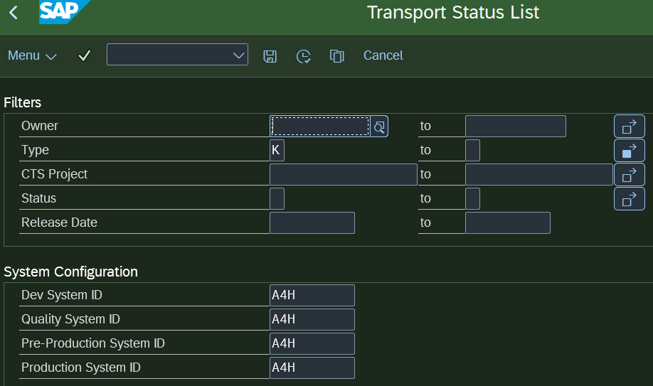
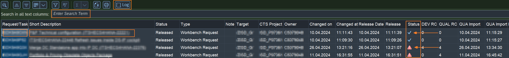

# Transport Status List

⚠️ Release Candidate version

Welcome!

This tool provides You a list of Transport Requests of Your team or the whole system. Helps people dealing with release management.

Supported onPremise versions: 2022+

## Filter capabilities

* Request owner
* Request type: Wokrbench, Customizing, Transport of Copy etc.
* CTS Project
* Release status
* Systems of your landscape: Development, Quality, Pre-production, Production.
  Best to save it in a variant. Entering the Pre-Production System ID parameter will show additional columns with the Import Status

## Working with the ALV

### Actions and Hotspots

* Display Log of the selected TR
* Free text search in text columns ( currently enabled for Short Description)
* Double click on TR Number results in displaying technical field names/values
* Click on Short description opens the TR

## Technicals

The report itself is based on CDS Entities created for this purpose, due such CDS objects are not present in the SAP standard on top of the transport request tables. As result it provides fast HANA based search capabilities comparing to the legacy version. The import status/return code of the transport requests are however still read from the target systems using RFC enabled function modules. You do not need to do any config for RFC, because the application is using the default TMS configuration.

Planned features:

* Customizing to store system landscape configuration
* Fiori List report
